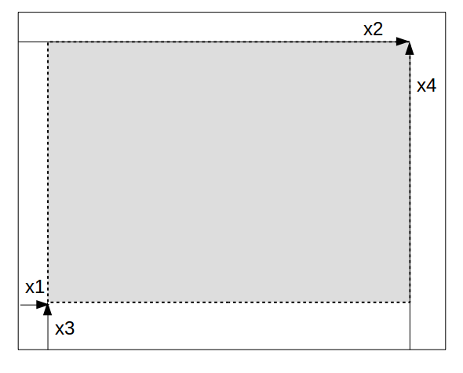

# Development of GRUtils

GRUtils This package is a refactoring of the module `jlgr` from [GR](https://github.com/jheinen/GR.jl). The purpose of GRUtils is to provide the main utilities of `jlgr` in a more "Julian" and modular style, easier to read, and facilitate code contributions by others.

GRUtils is being maintained in a package apart from GR, in order to make its development faster, but if some day it reaches sufficient quality to be considered a valuable contribution to GR, its author will be happy to give away its code so that it can be integrated in the excellent package created by [Joseph Heinen](https://github.com/jheinen/).

## Structure of plots in GRUtils

GRUtils replaces some long, convoluted functions of `jlgr` with many `if-else` blocks by more numerous but smaller functions based on type-dispatch, and takes advantage of meta-programming, such that those functions can be revised and debugged more easily, and new utilities can be added with new functions and methods without having to modify the existing ones.

Plots are composed by a set of objects of different types, which are defined in separate source files, as described next.

### Figures

*Figures* are the "top-level" objects, that contain all the information of a plot or set of "subplots" that are meant to be drawn together. This is represented by the type `Figure`:

```julia
struct Figure
    workstation::Tuple{Float64, Float64}
    plots::Vector{PlotObject}
end
```

The parameters contained in a figure are:

* **`workstation`**: a `Tuple{Float64, Float64}` that defines the width and height of the overall plot container (workstation), in pixels.

* **`plots`**: a vector of `PlotObject` elements, which contain the information of the individual plots included in the figure.

There is a global "current figure" that can be obtained by the function `gcf()` &mdash; with no arguments.

### Plot objects

```julia
mutable struct PlotObject
    viewport::Viewport
    axes::Axes
    geoms::Vector{<:Geometry}
    legend::Legend
    colorbar::Colorbar
    specs::Dict
end
```

The objects of the type `PlotObject` represent what can be considered a "complete" single plot. This type is roughly equivalent to the type of the same name defined in `jlgr`, although its structure is quite different. A plot object contains the following parameters, which are defined in subsequent sections:

* **`viewport`**: a `Viewport` object, which defines the area covered by the plot and the coordinate axes in the display.
* **`axes`**: an `Axes` object that defines how to represent the coordinate axes of the space where the plot is contained.
* **`geoms`**: a vector of `Geometry` objects that are plotted in the axes (roughly equivalent to the `args` field in `PlotObject` items of `jlgr`).
* **`legend`**: a `Legend` object that defines how to present a legend of the different geometries (if required).
* **`colorbar`**: a `Colorbar` object that defines how to present the guide to the color scale (if required).
* **`specs`**: a dictionary (`Dict{Symbol, Any}`) with varied plot specifications, including the title, axis labels, and other data that modify the default way of representing the different components of the plot.

The last plot of a figure `f` is considered itself its "current plot", and can be referred to by the function `currentplot(f)`. If no argument is given to `currentplot()`, the last plot of the current figure is returned &mdash; equivalent to `currentplot(gcf())`. In `jlgr`, the function `gcf()` directly returns the global current plot, which can also be identified by `jlgr.plt`.

### Viewport

```julia
struct Viewport
    outer::Vector{Float64}
    inner::Vector{Float64}
end
```

The `Viewport` of a plot defines the "normalized device coordinates" (NDC) of the outer box that contains all the elements of a plot, and of the inner box where the main items (axes and geometries) are plotted.

Such boxes are defined by 4 coordinates; the first and second coordinates are the distances between the left margin of the device and the left and right borders of the box, respectively; the third and fourth coordinates are the distances between the bottom of the device and the bottom and top borders, respectively.



NDC are given in dimensionless units between 0 and 1, such that `(0, 1, 0, 1)` means a box that spans over the whole device.

In `jlgr`, the outer and inner boxes of a plot are described in the field `kvs` of the corresponding `PlotObject` item. For instance, for the global "current plot" `plt`, the coordinates of the outer box are `plt.kvs[:viewport]`, and for the inner box they are `plt.kvs[:vp]`.

### Geometries

```julia
struct Geometry
    kind::Symbol
    x::Vector{Float64}
    y::Vector{Float64}
    z::Vector{Float64}
    c::Vector{Float64}
    spec::String
    label::String
    attributes::Dict{Symbol,Float64}
end
```

The objects of type `Geometry` contain the data represented in a plot by means of geometric elements (lines, markers, shapes, etc.).

Each `Geometry` has a `kind`, given by a `Symbol` with the name of the geometric element that it represents, such as `:line` for lines, `:scatter` for scattered points, `:bar` for bars, etc. In addition it has the following fields:

* **`x`**, **`y`**, **`z`**, **`c`**: vectors of `Float64` numbers that are mapped to different characteristics of the geometry. `x` and `y` are normally their X and Y coordinates; `z` usually is its Z coordinate in 3-D plots, or another aesthetic feature (e.g. the size in scatter plots); `c` is usually meant to represent the color scale, if it exists.
* **`spec`**: a `String` with the specification of the line style, the type of marker and the color of lines in line plots. (Cf. the defintion of format strings in [matplotlib](https://matplotlib.org/3.1.1/api/_as_gen/matplotlib.pyplot.plot.html))
* **`label`**: a `String` with the label used to identify the geometry in the plot legend.
* **`attributes`**: a `Dict{Symbol, Float64}` with extra attributes to control how geometries are plotted.

In `jlgr`, all those data except the ones contained in the field `attributes` are given in the elements of the `args` vector of the corresponding `PlotObject` item.

### Axes

```julia
struct Axes
    kind::Symbol
    ranges::Dict{Symbol, Tuple{Float64, Float64}}
    tickdata::Dict{Symbol, Tuple{Float64, Tuple{Float64,Float64}, Int}}
    ticklabels::Dict{Symbol, <:Function}
    perspective::Vector{Int}
    options::Dict{Symbol, Int}
end
```

`Axes` is a type of objects that contain the graphical specifications of the coordinate system of a plot.

Axes are determined by their **`kind`**, which may be `:axes2d` for 2-D plots, `:axes3d` for 3-D plots, and `:axespolar` for polar plots. The rest of its fields are:

* **`ranges`**: boundaries of the different axes/scales. They are given as a dictionary whose keys are symbols with the name of the axis (`:x`, `:y`, `:z`, `:c`), and whose values are tuples with two float values &mdash; the minimum and maximum values, respectively.
* `tickdata`: numeric specifications of the "ticks" that are drawn on the axes. They are given as a dictionary whose keys are the names of the axis (as for `range`), and whose values are tuples that contain for that axis: (1) the "minor" value between consecutive ticks; (2) a tuple with the two ends of the axis ticks; and (3) the number of minor ticks between "major", numbered ticks.
* **`ticklabels`**: transformations between tick values and labels. They are given as a dictionary whose keys are the names of the axis, and whose values are functions that accept a number as argument, and return a string with the text that must be written at major ticks. (This only works for the X and Y axes).
* **`perspective`**: A `Vector{Int}` that contains the "rotation" and "tilt" angles that are used to project 3-D axes on the plot plane. (Only for 3-D plots)
* **`options`**: A `Dict{Symbol, Int}` with extra options that control the visualization of the axes.

In `jlgr`, all those data are described in the dictionary `kvs` contained in the corresponding `PlotObject` item.

### Legends

```julia
struct Legend
    size::Tuple{Float64, Float64}
    cursors::Vector{Tuple{Float64, Float64}}
end
```

`Legend` objects contain the data that defines the frame where legends are drawn. They contain two fields:

* **`size`**: a 2-tuple that defines the width and height of the legend frame in NDC.
* **`cursors`**: a vector of 2-tuples that marks the positions of the legend items inside the legend frame, also in NDC, but relative to the top-left corner of the frame.

The symbols and labels that should be shown in the legend are not described in the `Legend` object, but they are fetched from the `Geometry` objects used in the plot where the legend is defined.

In `jlgr`, those values are not stored in any parameter of plot objects. Only the relative position of the legend with respect to the axes area is stored, and everything is calculated in the moment of drawing the plot.

### Color bars

```julia
struct Colorbar
    range::Tuple{Float64, Float64}
    tick::Float64
    scale::Int
    margin::Float64
    colors::Int
end
```

A `Colorbar` object contains the data that defines the colorbar associated to a plot. The fields contained in a `Colorbar` object are:

* **`range`**: a 2-tuple with the limits of the color scale represented in the bar.
* **`tick`**: the distance between tick marks drawn as guide next to the bar.
* **`scale`** an integer code used by `GR.setscale` to define the scale of the bar (basically, if it is presented as linear or log scale).
* **`margin`**: size of the extra margin between the main plot frame and the bar.
* **`colors`**: number of different grades into which the color scale is divided.

In `jlgr`, those values are not stored in any parameter of plot objects, and everything is calculated in the moment of drawing the plot, if suitable.

## Creating plots

At the lowest level, a single plot can be created through the following steps:

1. Define a `Viewport` with the NDC of the boxes where the plot should be drawn.
2. Create one or more `Geometry` objects based on the data that should be plotted and the kind of geometries that will represent them, and collect them in a vector.
3. Create an `Axes` object with suitable dimensions and properties to contain the geometries.
4. Create a `Legend` to display the legends, if suitable.
5. Create a `Colorbar` to represent a guide to color codes, if suitable.
6. Put all the previous components together in a `PlotObject`.
7. Take a `Figure` where the plot should be displayed &mdash; e.g. the current figure through `gcf()`, or create it, and put the newly created `PlotObject` into the `plots` vector of that figure.

GRUtils also provides various constructors of those types and other functions that
make those steps easier, as presented next.

### `Viewport` constructors

```julia
Viewport(subplot, frame::Bool [, ratio::Real, margins])
```

This method makes a `Viewport` for a plot taking the normalized coordinates of the box that contains it (`subplot`, which are normalized with respect to the size of the figure, not the whole device), and a flag (`frame::Bool`) telling whether there should be a frame between the outer and inner boxes. The size of that frame is calculated automatically.

This constructor also accepts two optional arguments: `ratio`, which is the width:height ratio of the inner box, and `margins`, a 4-vector with extra margins that there should be between the outer and inner boxes, in addition to the default size of the frame (in the order left-right-bottom-top).

### `Geometry` constructors

```julia
Geometry(kind::Symbol [; kwargs...])
```

Most geometries do not need data for all the possible parameters that the `Geometry` type accepts. Thus, to simplify the creation of geometries, an alternative constructor takes the geometry's `kind` as the only positional argument, and the rest of fields are given as keyword arguments (empty by default).

Besides, there is a function `geometries` to directly create a vector of `Geometry` objects from the input data easily, taking advantage of multiple dispatch:

```julia
geometries(kind, x [, y, z, c; kwargs...]) -> Vector{Geometry}
```

The positional arguments of this function are the `kind` of the geometry, and the variables that define the coordinates of the geometries. All the other parameters are given as keyword arguments, just as in the previously described constructor.

This function accepts coordinates defined only by one array of numbers, by two variables ( `x` and `y`, typically for 2-D plots), three (`x`, `y`, `z`) or all four variables (`x`, `y`, `z` and `c`). If there is only one array `x` of real numbers given for the geometry coordinates, they will actually be used as Y coordinates, and X will be defined as a sequence of integers starting at 1. If that array contains complex numbers, the real part
will be taken as X coordinates, and the imaginary part as Y coordinates.

The coordinates can be given as vectors or matrices with the same number of rows. In the latter case, each column of the matrices will be used to define a different `Geometry`. If some coordinates are given as vectors while other are in matrices, vectors will be recycled in all the geometries. E.g. `x` is a vector with `N` numbers and `y` a matrix with `N` rows and `M` columns, the result will be a `N`-vector of geometries `g` such that `g[i]` will be a geometry whose X coordinates are the vector `x`, and whose Y coordinates are the `i`-th column of `y`.

In addition, the last coordinate can be given as a "broadcastable" function that takes the previous coordinates as inputs.

### `Axes` constructors

```julia
Axes(kind::Symbol [; kwargs...])
Axes(kind, geoms::Array{<:Geometry} [; kwargs...])
```

As in the case of `Geometry`, an alternative `Axes` constructor is provided that only requires the `kind` of the axes (`:axes2d`, `:axes3d` or `:axespolar`),
such that all the other parameters are passed as keyword arguments. Null or
empty values are used by default for the parameters that are not given.

Besides, there is another `Axes` constructor that takes the kind of the axes and the vector of geometries that is meant to be plotted inside the axes, in order to calculate the different axis limits, ticks, etc. Keyword arguments are used to modify the default calculations.

### `Legend` constructors

```julia
Legend(geoms [, maxrows])
```

This `Legend` constructor takes the collection of geometries that are meant to be referred to in the legend, and calculates the dimensions of the legend frame such that it can contain guides to all the geometries that have a non-empty `label`.

Optionally, this constructor takes the maximum number of items that should be represented in a column of the legend, and if the number of labelled geometries exceeds that maximum, the legend is sized to contain all needed columns.

### `Colorbar` constructors

```julia
Colorbar(axes::Axes [, colors=256])
```

This `Colorbar` constructor takes the `Axes` object that is used to calculate the different properties of the color bar, depending on the kind of axis and the range of the `c` axis, which is normally meant to contain the variable that is mapped to a color scale. If the `c` axis is not defined in the axes, this constructor will return an empty `Colorbar`.

### Top-level plot constructors

The constructors presented above for the different components of a plot allow to build plots from data using different "grammars". Besides, GRUtils also provide top-level functions for plot creation that imitate the interface provided by `jlgr`.

Since all those functions follow the same basic steps described above, a macro `@plotfunction` is provided to create them from a template. The interface of this macro is:

```julia
@plotfunction(fname, options...)
```

That macro creates two functions, e.g. `@plotfunction plot` creates the following:

* `plot!(f::Figure, args...; kwargs...)`
* `plot(args...; kwargs...)`

The first of those functions (the one whose name ends with an exclamation) edits the figure given as first argument, replacing its last plot by a new one. The second function (the one without exclamation) creates the plot in the current figure. How those functions work depends on the options that are passed after the function name to the macro. Those options are expressed in the fashion of keyword argments, i.e. as
`key = value`, and they can be the following:

* **`geom`**: a `Symbol` with the name of the kind of the `Geometry` that is created.
* **`axes`**: a `Symbol` with the name of the kind of the `Axes` that are created.
* **`plotkind`**: a `Symbol` with the name of the plot kind (only needed as meta-data). If this option is not given, the name of the function is used by default.
* **`setargs`**: a function that takes the positional and keyword arguments that are passed to the functions, and transforms and extends them to return: (a) a tuple of positional arguments to be passed to the function `geometries`, and (b) the set of keyword arguments that are passed to the constructor of geometries, axes, and the plot object. If `setargs` is not defined, the positional and keyword arguments are returned untransformed.
* **`kwargs`**: a named tuple with extra keyword arguments that are passed to the constructors of geometries, axes and the plot object.
* **`docstring`**: the documentation string that will be assigned to those functions.

## Drawing plots

The function `draw` executes the instructions that create the graphical visualization of a plot and its components. That function has specialized methods for the different types that have been defined above. In a top-down order:

* `draw(::Figure)` sets up the workspace and calls the `draw` method for all the `PlotObject`s  contained in `plots`.
* `draw(::PlotObject)` does the following actions:
    1. Paint the background and set the viewport defined by the `viewport` field.
    2. Call the method `draw` on the plot's `axes`.
    3. Call the method `draw` on each item of `geoms`.
    4. Call `draw` on `legend` it is not an empty legend and `specs[:location] ≠ 0`.
    5. Call `draw` on `colorbar`if it is not an empty color bar and `specs[:colorbar] == true`).
    6. Write different labels and decorations in axes, title, etc, as defined in `specs`.
* `draw(::Axes)` sets the window and the scale defined by the axes ranges and specifications &mdash; except in the case of polar plots, where the polar coordinates are transformed into the Cartesian coordinates of a square of fixed size, and then draws the axes themselves and their guides.
* `draw(::Geometry)` calls specialized methods for the geometry's `kind`, and returns either `nothing` or a `Vector{Float64}` with the limits of the color scale &mdash; when it is calculated by the drawing operation, e.g. in the case of hexagonal bins.
* Legends are drawn by the method `draw(lg::Legend, geoms, location)`, where `geoms` is a vector with the geometries of the plot, and `location` is an integer code that defines the location of the legend with respect to the main plot area &mdash; as defined in [Matplotlib legends](https://matplotlib.org/3.1.1/api/_as_gen/matplotlib.pyplot.legend.html). The geometries are passed down to the `guide` function, which has specialized methods for the kind of geometries that can be represented in legends.
* Color bars are drawn by the method `draw(cb::Colorbar [, range])`,
where the optional `range` is by default `cb.range`, but can be overriden by
other values.

## Extending GRUtils

One of the purposes of GRUtils' structure is to facilitate its extension through new kinds of plots. New functions to create plots based on existing geometries (e.g. through statistical transformation of the data) can be created with the `@plotfunction` macro and a custom function that sets up the data. Histograms are an example of this: the input of a histogram is a set of values that are binned, such that the histogram itself is a bar plot with the frequencies of the bins. Now, the histogram functions are defined though something like:

```julia
@plotfunction(histogram, geom = :bar, axes = :axes2d, kind = :hist,
setargs = _setargs_hist, docstring = doc_hist)
```

The expressions used in that macro call are:

* `histogram`: the name of the function that will be created.
* `geom = :bar`, to declare that the kind of the histogram geometries will be `:bar`.
* `axes = :axes2d`, to declare that it will be a plot drawn on 2-D axes.
* `kind = :hist`, an arbitrary option that helps to identify the kind of plot that will be made, although this is not currently used.
* `setargs = _setargs_hist`: this is where the magic occurs. `_setargs_hist` is the name of a function that makes the transformation of the input data into the coordinates of the bars.
* `docstring = doc_hist`: this is used to define the documentation string that will be associated both to `histogram` and `histogram!` (in this example contained in the variable `doc_hist`).

If the new kind of plot implies the definition of a new kind of geometry, other methods should be created in addition. Let's say that this new geometry is called `mygeom`; then at least the following method should be defined:

```julia
draw(g::Geometry, ::Val{:mygeom})
```

This method should contain the low-level plotting instructions based on the functions of GR to draw the geometries (lines, markers, areas and other elements), using the data contained in `g`. The returned value should be `nothing`, unless the ends of the color scale are not given in the geometry `g`, but calculated by the functions of GR. In such case, this method can return a vector with the minimum and maximum values of the color scale (as `Float64`).

If the new geometry is also meant to have a legend key, the following method of the `guide` function should also be defined:

```julia
guide(Val{:mygeom}, g, x, y)
```

This method should contain the plotting instructions to draw the key associated to the geometry `g`  in the (`x`, `y` coordinates). The dimensions of the key should not go outside a rectangular box centred in `(0.0, 0.0)`, with width equal to `0.06` and height equal to `0.03`, in NDC units.
