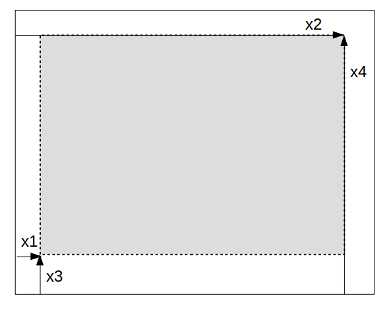

```@meta
CurrentModule = GRUtils
```
# Structure of plots

GRUtils replaces some long, convoluted functions of `jlgr` with many `if-else` blocks by more numerous, but smaller functions based on type-dispatch, and takes advantage of meta-programming, such that those functions can be revised and debugged easily, and new utilities can be added with new functions and methods, without having to modify the existing ones.

Plots are composed of a set of objects of different types, which are defined below, along with some notes comparing this structure with the plots produced in `jlgr`.

### Figures

Figures are the "top-level" objects, that contain all the information of a plot or set of "subplots" that are meant to be drawn together. This is represented by the type `Figure`, which is basically a collection of plots, gathered in a graphic workstation of a given size. Its structure is simple, defined in a very basic constructor:

```@docs
Figure
```

### Plot objects

The type `PlotObject` provides the data structure for what can be considered a "complete" single plot. This type is roughly equivalent to the type of the same name defined in `jlgr`, although its structure is quite different:

```@docs
PlotObject
```

All the parameters of a `PlotObject` are instances of other types for the different elements of a plot, which are defined below. `PlotObject` is a mutable type, which means that those parameters can be replaced by others of the same type without having to replace the whole object.

The last plot of a figure `f` is considered itself its "current plot", and can be referred to by the function `currentplot(f)`. If no argument is given to `currentplot()`, the last plot of the current figure is returned — equivalent to `currentplot(gcf())`.

!!! note

    In `jlgr`, the function `gcf()` directly returns the global current plot, which can also be identified by `jlgr.plt`.

### Viewport

```@docs
Viewport
```

The `Viewport` of a plot defines the "normalized device coordinates" (NDC) of the outer box that contains all the elements of a plot, and of the inner box where the main items (axes and geometries) are plotted.

Such boxes are defined by 4 coordinates; the first and second coordinates are the distances between the left margin of the device and the left and right borders of the box, respectively; the third and fourth coordinates are the distances between the bottom of the device and the bottom and top borders, respectively.



NDC are given in dimensionless units between 0 and 1, such that `(0, 1, 0, 1)` means a box that spans over the whole device.

!!! note

    In `jlgr`, the outer and inner boxes of a plot are described in the field `kvs` of the corresponding `PlotObject` item. For instance, for the global "current plot" `plt`, the coordinates of the outer box are `plt.kvs[:viewport]`, and for the inner box they are `plt.kvs[:vp]`.)

### Geometries

```@docs
Geometry
```

!!! note

    In `jlgr`, all those data except the ones contained in the field `attributes` are given in the elements of the `args` vector of the corresponding `PlotObject` item.

### Axes

```@docs
Axes
```
!!! note

    In `jlgr`, most of those data are described in the dictionary `kvs` contained in the corresponding `PlotObject` item, or calculated during plotting operations without being stored.

### Legends

```@docs
Legend
```

The symbols and labels that should be shown in the legend are not described in the `Legend` object, but they are fetched from the `Geometry` objects used in the plot where the legend is defined.

!!! note

    In `jlgr`, those values are not stored in any parameter of plot objects. Only the relative position of the legend with respect to the axes area is stored, and everything is calculated in the moment of drawing the plot.)

### Color bars

```@docs
Colorbar
```

!!! note
    In `jlgr`, those values are not stored in any parameter of plot objects, and everything is calculated in the moment of drawing the plot, if suitable.
