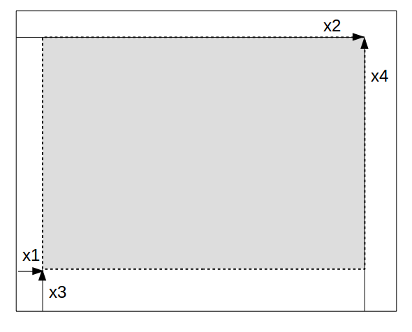

# Structure of plots in GRUtils

GRUtils replaces some long, convoluted functions of `jlgr` with many `if-else` blocks by more numerous but smaller functions based on type-dispatch, and takes advantage of meta-programming, such that those functions can be revised and debugged more easily, and new utilities can be added with new functions and methods without having to modify the existing ones.

Plots are composed by a set of objects of different types, which are defined in separate source files, as described next.

### Figures

*Figures* are the "top-level" objects, that contain all the information of a plot or set of "subplots" that are meant to be drawn together. This is represented by the type `Figure`:

```julia
struct Figure
    workstation::Tuple{Float64, Float64}
    plots::Vector{PlotObject}
end
```

The parameters contained in a figure are:

* **`workstation`**: a `Tuple{Float64, Float64}` that defines the width and height of the overall plot container (workstation), in pixels.

* **`plots`**: a vector of `PlotObject` elements, which contain the information of the individual plots included in the figure.

There is a global "current figure" that can be obtained by the function `gcf()` &mdash; with no arguments.

### Plot objects

```julia
mutable struct PlotObject
    viewport::Viewport
    axes::Axes
    geoms::Vector{<:Geometry}
    legend::Legend
    colorbar::Colorbar
    specs::Dict
end
```

The objects of the type `PlotObject` represent what can be considered a "complete" single plot. This type is roughly equivalent to the type of the same name defined in `jlgr`, although its structure is quite different. A plot object contains the following parameters, which are defined in subsequent sections:

* **`viewport`**: a `Viewport` object, which defines the area covered by the plot and the coordinate axes in the display.
* **`axes`**: an `Axes` object that defines how to represent the coordinate axes of the space where the plot is contained.
* **`geoms`**: a vector of `Geometry` objects that are plotted in the axes (roughly equivalent to the `args` field in `PlotObject` items of `jlgr`).
* **`legend`**: a `Legend` object that defines how to present a legend of the different geometries (if required).
* **`colorbar`**: a `Colorbar` object that defines how to present the guide to the color scale (if required).
* **`specs`**: a dictionary (`Dict{Symbol, Any}`) with varied plot specifications, including the title, axis labels, and other data that modify the default way of representing the different components of the plot.

The last plot of a figure `f` is considered itself its "current plot", and can be referred to by the function `currentplot(f)`. If no argument is given to `currentplot()`, the last plot of the current figure is returned &mdash; equivalent to `currentplot(gcf())`. In `jlgr`, the function `gcf()` directly returns the global current plot, which can also be identified by `jlgr.plt`.

### Viewport

```julia
struct Viewport
    outer::Vector{Float64}
    inner::Vector{Float64}
end
```

The `Viewport` of a plot defines the "normalized device coordinates" (NDC) of the outer box that contains all the elements of a plot, and of the inner box where the main items (axes and geometries) are plotted.

Such boxes are defined by 4 coordinates; the first and second coordinates are the distances between the left margin of the device and the left and right borders of the box, respectively; the third and fourth coordinates are the distances between the bottom of the device and the bottom and top borders, respectively.



NDC are given in dimensionless units between 0 and 1, such that `(0, 1, 0, 1)` means a box that spans over the whole device.

In `jlgr`, the outer and inner boxes of a plot are described in the field `kvs` of the corresponding `PlotObject` item. For instance, for the global "current plot" `plt`, the coordinates of the outer box are `plt.kvs[:viewport]`, and for the inner box they are `plt.kvs[:vp]`.

### Geometries

```julia
struct Geometry
    kind::Symbol
    x::Vector{Float64}
    y::Vector{Float64}
    z::Vector{Float64}
    c::Vector{Float64}
    spec::String
    label::String
    attributes::Dict{Symbol,Float64}
end
```

The objects of type `Geometry` contain the data represented in a plot by means of geometric elements (lines, markers, shapes, etc.).

Each `Geometry` has a `kind`, given by a `Symbol` with the name of the geometric element that it represents, such as `:line` for lines, `:scatter` for scattered points, `:bar` for bars, etc. In addition it has the following fields:

* **`x`**, **`y`**, **`z`**, **`c`**: vectors of `Float64` numbers that are mapped to different characteristics of the geometry. `x` and `y` are normally their X and Y coordinates; `z` usually is its Z coordinate in 3-D plots, or another aesthetic feature (e.g. the size in scatter plots); `c` is usually meant to represent the color scale, if it exists.
* **`spec`**: a `String` with the specification of the line style, the type of marker and the color of lines in line plots. (Cf. the defintion of format strings in [matplotlib](https://matplotlib.org/3.1.1/api/_as_gen/matplotlib.pyplot.plot.html))
* **`label`**: a `String` with the label used to identify the geometry in the plot legend.
* **`attributes`**: a `Dict{Symbol, Float64}` with extra attributes to control how geometries are plotted.

In `jlgr`, all those data except the ones contained in the field `attributes` are given in the elements of the `args` vector of the corresponding `PlotObject` item.

### Axes

```julia
struct Axes
    kind::Symbol
    ranges::Dict{Symbol, Tuple{Float64, Float64}}
    tickdata::Dict{Symbol, Tuple{Float64, Tuple{Float64,Float64}, Int}}
    ticklabels::Dict{Symbol, <:Function}
    perspective::Vector{Int}
    options::Dict{Symbol, Int}
end
```

`Axes` is a type of objects that contain the graphical specifications of the coordinate system of a plot.

Axes are determined by their **`kind`**, which may be `:axes2d` for 2-D plots, `:axes3d` for 3-D plots, and `:axespolar` for polar plots. The rest of its fields are:

* **`ranges`**: boundaries of the different axes/scales. They are given as a dictionary whose keys are symbols with the name of the axis (`:x`, `:y`, `:z`, `:c`), and whose values are tuples with two float values &mdash; the minimum and maximum values, respectively.
* `tickdata`: numeric specifications of the "ticks" that are drawn on the axes. They are given as a dictionary whose keys are the names of the axis (as for `range`), and whose values are tuples that contain for that axis: (1) the "minor" value between consecutive ticks; (2) a tuple with the two ends of the axis ticks; and (3) the number of minor ticks between "major", numbered ticks.
* **`ticklabels`**: transformations between tick values and labels. They are given as a dictionary whose keys are the names of the axis, and whose values are functions that accept a number as argument, and return a string with the text that must be written at major ticks. (This only works for the X and Y axes).
* **`perspective`**: A `Vector{Int}` that contains the "rotation" and "tilt" angles that are used to project 3-D axes on the plot plane. (Only for 3-D plots)
* **`options`**: A `Dict{Symbol, Int}` with extra options that control the visualization of the axes.

In `jlgr`, all those data are described in the dictionary `kvs` contained in the corresponding `PlotObject` item.

### Legends

```julia
struct Legend
    size::Tuple{Float64, Float64}
    cursors::Vector{Tuple{Float64, Float64}}
end
```

`Legend` objects contain the data that defines the frame where legends are drawn. They contain two fields:

* **`size`**: a 2-tuple that defines the width and height of the legend frame in NDC.
* **`cursors`**: a vector of 2-tuples that marks the positions of the legend items inside the legend frame, also in NDC, but relative to the top-left corner of the frame.

The symbols and labels that should be shown in the legend are not described in the `Legend` object, but they are fetched from the `Geometry` objects used in the plot where the legend is defined.

In `jlgr`, those values are not stored in any parameter of plot objects. Only the relative position of the legend with respect to the axes area is stored, and everything is calculated in the moment of drawing the plot.

### Color bars

```julia
struct Colorbar
    range::Tuple{Float64, Float64}
    tick::Float64
    scale::Int
    margin::Float64
    colors::Int
end
```

A `Colorbar` object contains the data that defines the colorbar associated to a plot. The fields contained in a `Colorbar` object are:

* **`range`**: a 2-tuple with the limits of the color scale represented in the bar.
* **`tick`**: the distance between tick marks drawn as guide next to the bar.
* **`scale`** an integer code used by `GR.setscale` to define the scale of the bar (basically, if it is presented as linear or log scale).
* **`margin`**: size of the extra margin between the main plot frame and the bar.
* **`colors`**: number of different grades into which the color scale is divided.

In `jlgr`, those values are not stored in any parameter of plot objects, and everything is calculated in the moment of drawing the plot, if suitable.
